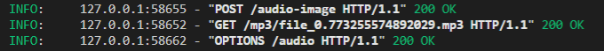
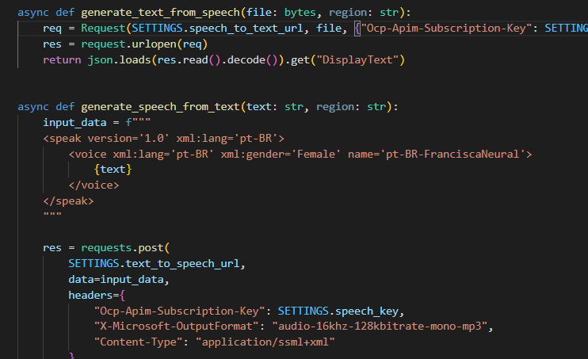

## **5ª Hackatona** - Inclusão Social de ou Surdos ou Cegos
# **KROKS**

* justificativa(motivacao)
* features
* estrutura das features 
* arquitetura do projeto
* mostrar

## Back End
Neste projeto foi utlizado a linguagem de programação **python**, para a escrita do **back end**. Onde nela utilizamos de frameworks como *fast-api*, e bibliotécas como: *Urllib* e *Request*. 

 ;Mas com certeza as estrelas dessa aplicação são as APIs da Azure, o **Computervision** e **Speech-service**. Nelas conseguimos realizar a conversão de audio para texto, e vice-e-versa, além de realizar uma classsificação de imagem com **inteligencia artificial**.

## Front End
